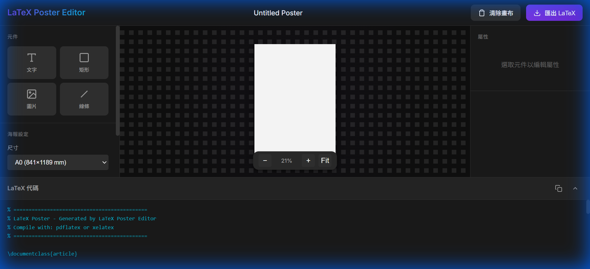
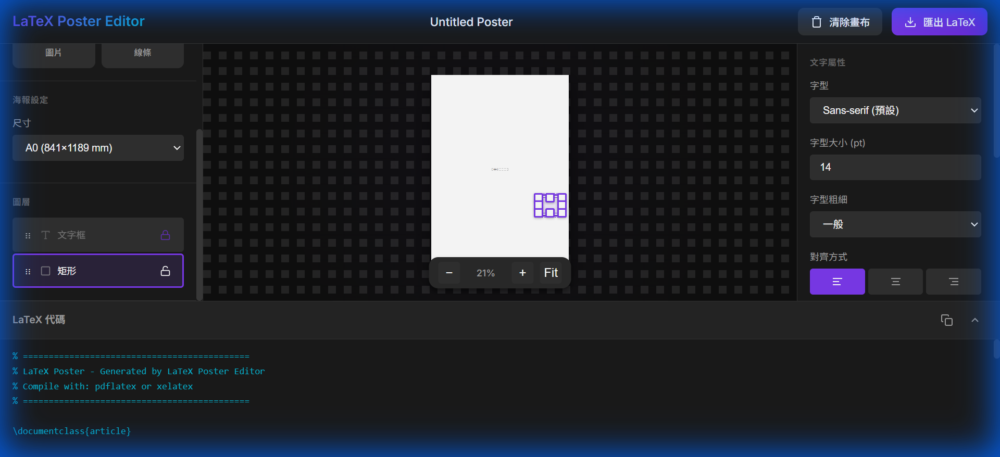
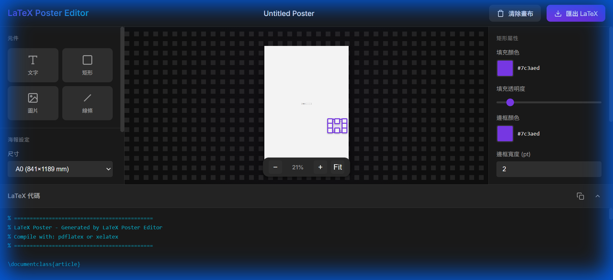

# LaTeX Poster Editor

<div align="center">



A **Canva-like visual editor** for creating LaTeX posters. Design your poster visually and export production-ready LaTeX code.

[](https://vitejs.dev/)
[](https://developer.mozilla.org/en-US/docs/Web/JavaScript)

</div>

---

## ✨ Features

### 🎨 Visual Editing
- **Drag & Drop Elements** - Add text boxes, rectangles, images, and lines
- **Resize Handles** - Intuitive corner and edge handles for precise sizing
- **Real-time Preview** - See your poster exactly as it will render

### 📐 Precise Positioning
- **Snap Alignment** - Automatic snapping to element edges and centers
- **Property Panel** - Fine-tune position (X, Y) and dimensions (W, H)
- **Zoom Controls** - Zoom in/out for detailed work

### 🔒 Layer Management
- **Layer Panel** - View and manage all elements
- **Drag to Reorder** - Change z-index by dragging layers
- **Layer Lock** - Lock layers to prevent accidental modifications



### 📄 LaTeX Export
- **One-Click Export** - Generate complete LaTeX documents
- **Live Code Preview** - See LaTeX code update in real-time
- **Copy to Clipboard** - Quick copy for integration into existing projects

---

## 🚀 Quick Start

### Prerequisites
- [Node.js](https://nodejs.org/) (v16 or higher)
- npm or yarn

### Installation

```bash
# Clone the repository
git clone https://github.com/Avalas00/LaTeX_Poster_Editor.git
cd LaTeX_Poster_Editor

# Install dependencies
npm install

# Start development server
npm run dev
```

Open your browser and navigate to `http://localhost:5173/`

### Build for Production

```bash
npm run build
```

The production files will be in the `dist/` folder.

---

## 📖 Usage Guide

### Adding Elements

| Element | Description |
|---------|-------------|
| 📝 **文字** | Add text boxes with customizable fonts, sizes, and colors |
| ⬜ **矩形** | Add rectangles with fill colors, borders, and rounded corners |
| 🖼️ **圖片** | Add images (requires image path for LaTeX) |
| ➖ **線條** | Add lines with customizable thickness and styles |



### Editing Properties

1. **Select an element** by clicking on it
2. **View properties** in the right panel
3. **Modify values** - changes apply in real-time
4. **Position & Size** - adjust X, Y, Width, Height in mm

### Layer Management

- **Reorder layers** - Drag the `⋮⋮` handle to change stacking order
- **Lock layers** - Click the 🔒 icon to prevent moving/resizing
- **Select layers** - Click a layer to select it on the canvas

### Exporting LaTeX

1. Click **匯出 LaTeX** button in the header
2. A `.tex` file will be downloaded
3. Compile with `pdflatex` or `xelatex`:

```bash
pdflatex your_poster.tex
```

---

## 🛠️ Technology Stack

- **Frontend**: Vanilla JavaScript (ES6+)
- **Build Tool**: Vite
- **Styling**: CSS with CSS Variables
- **LaTeX**: TikZ for shapes, textpos for text positioning

---

## 📁 Project Structure

```
latex-poster-editor/
├── index.html          # Main HTML entry point
├── src/
│   ├── main.js         # Application entry point
│   ├── canvas/         # Canvas management
│   │   ├── CanvasManager.js
│   │   └── SnapGuideManager.js
│   ├── elements/       # Element classes
│   │   ├── BaseElement.js
│   │   ├── TextElement.js
│   │   ├── RectElement.js
│   │   ├── LineElement.js
│   │   └── ImageElement.js
│   ├── panels/         # UI panels
│   │   └── PropertyPanel.js
│   ├── latex/          # LaTeX generation
│   │   └── LatexGenerator.js
│   └── styles/
│       └── main.css
└── docs/
    └── images/         # Documentation images
```

---

## 📝 License

MIT License - feel free to use for personal and commercial projects.

---

## 🤝 Contributing

Contributions are welcome! Please feel free to submit a Pull Request.

1. Fork the repository
2. Create your feature branch (`git checkout -b feature/AmazingFeature`)
3. Commit your changes (`git commit -m 'Add some AmazingFeature'`)
4. Push to the branch (`git push origin feature/AmazingFeature`)
5. Open a Pull Request

---

<div align="center">

**Made with ❤️ for the LaTeX community**

</div>
